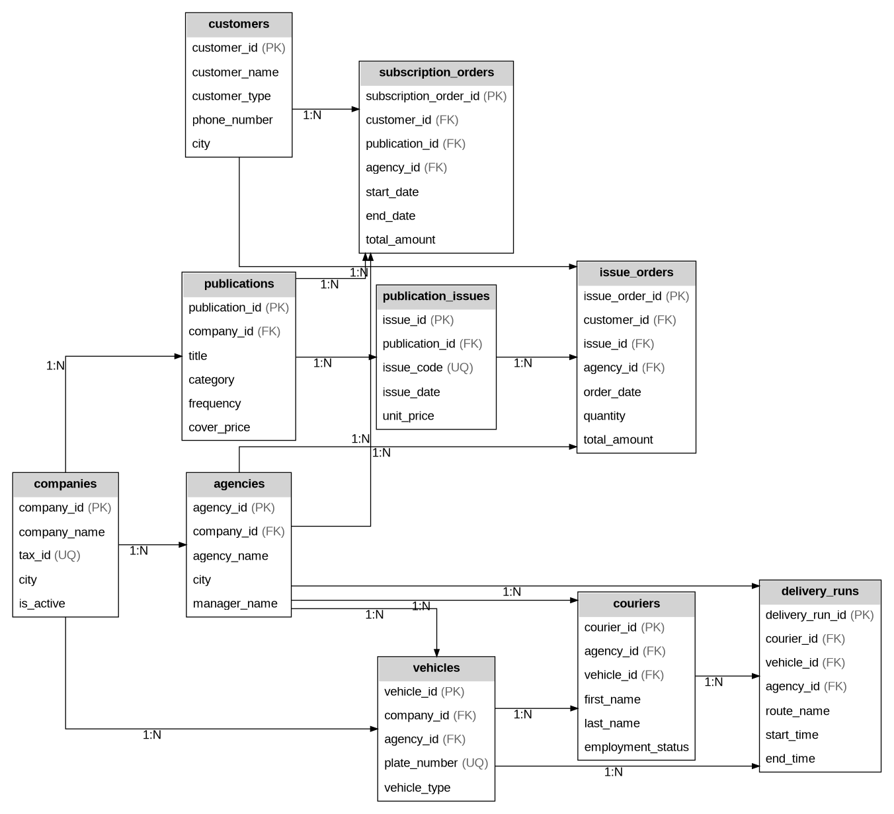

# Newsagent Company Database

Relational database schema for a newsagent and print distribution company.

## Database Schema

## Main Tables

| Table | Description |
|-----|-----|
| companies | Publishing companies |
| agencies | Local distribution agencies |
| publications | Newspapers and magazines |
| publication_issues | Individual publication releases |
| customers | Retail and business clients |
| vehicles | Delivery vehicles |
| couriers | Delivery employees |
| delivery_runs | Daily courier routes |
| subscription_orders | Recurring subscriptions |
| issue_orders | One-time issue purchases |

## Features

- Normalized relational schema
- Primary and foreign key constraints
- Data validation with CHECK constraints
- Realistic sample data
- Indexed columns for common queries
- Subscription and single-issue order management
- Delivery route tracking

## Technologies

- Microsoft SQL Server
- SQL
- T-SQL
